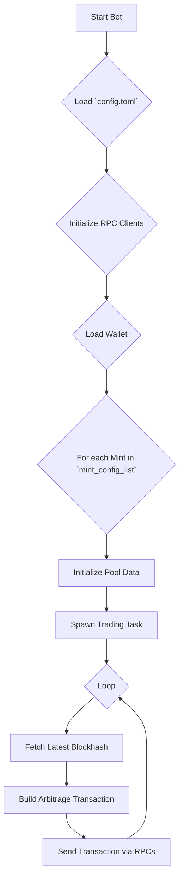
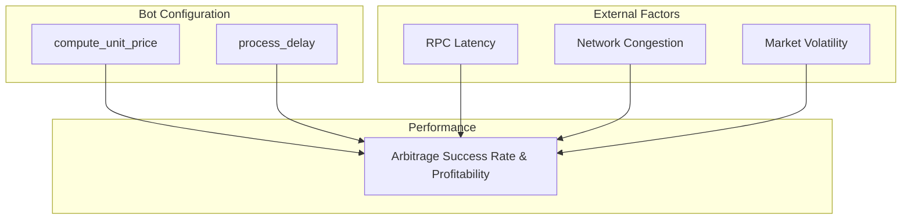
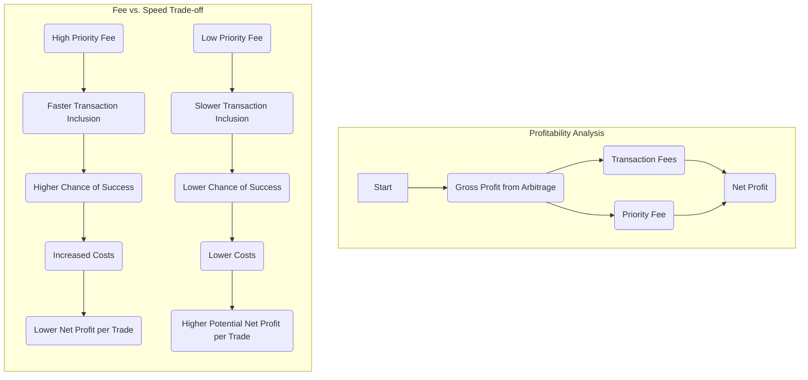
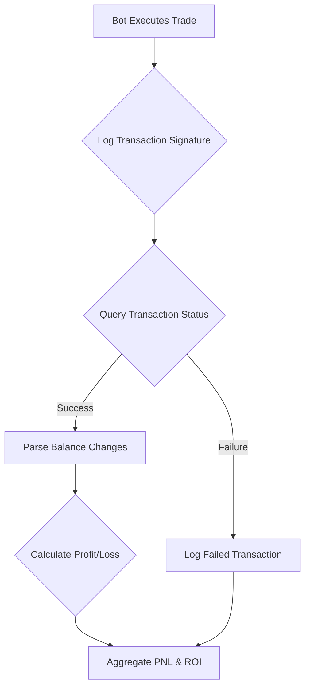

# Solana MEV Bot

A high-performance, flash-loan-integrated MEV (Maximal Extractable Value) arbitrage bot for the Solana blockchain. This Rust-based solution is engineered to identify and execute profitable arbitrage opportunities across a wide range of decentralized exchanges (DEXs).

## Contact Information

- **Discord**: [@i3visio](https://discord.gg/8Zu7W8pS)
- **Telegram**: [@i3visio](https://t.me/i3visio)
- **Email**: [i3visio89@gmail.com](mailto:i3visio89@gmail.com)

## Overview

The Solana Arbitrage Bot is a sophisticated framework designed for executing complex arbitrage strategies on the Solana network. It operates by monitoring price discrepancies of token pairs across various DEXs and executing atomic, multi-leg trades to capitalize on these differences. The integration of flash loans from Kamino Finance allows the bot to leverage significant capital, maximizing profitability without requiring large upfront investments.

This tool is intended for experienced developers and quantitative traders with a strong understanding of blockchain, DeFi, and MEV.

**Disclaimer:** This is an advanced trading tool that carries significant financial risk. The authors and contributors are not liable for any financial losses. Use this software at your own risk.

## Architecture Diagram

The following diagram illustrates the bot's operational flow:



## How It Works: The Bot Lifecycle

The bot operates through a structured, asynchronous lifecycle, designed for high performance and reliability.

1.  **Configuration Loading**: Upon launch, the bot reads the `config.toml` file to load its operational parameters, including the user's wallet, RPC endpoints, and the list of token mints to be arbitraged.

2.  **Initialization**: It establishes connections to the specified Solana RPC endpoints. The main RPC is used for fetching on-chain data, while a separate list of RPCs can be configured for spamming transactions to increase the chances of fast execution.

3.  **Wallet and ATA Setup**: The bot loads the user's keypair and, for each configured mint, it checks for the existence of an Associated Token Account (ATA). If an ATA is not found, the bot automatically creates it.

4.  **Pool Data Initialization**: For each mint, the bot fetches and parses the on-chain data for all the pools listed in the configuration. This includes pools from all supported DEXs. This data is stored in memory for quick access.

5.  **Blockhash Refreshing**: A background task is spawned to periodically refresh the latest blockhash. This is crucial for ensuring that transactions are submitted with a recent and valid blockhash.

6.  **Trading Loop**: For each configured mint, a separate asynchronous task is spawned. This task enters an infinite loop to continuously perform the following steps:
    *   **Build Transaction**: It constructs a single, atomic transaction that executes the arbitrage. This transaction is a cross-program invocation (CPI) to a dedicated on-chain program (`MEViEnscUm6tsQRoGd9h6nLQaQspKj7DB2M5FwM3Xvz`) that handles the multi-leg swaps and flash loan.
    *   **Send Transaction**: The transaction is signed and sent to the network through the configured RPC endpoints. If spam mode is enabled, it sends the transaction through multiple RPCs simultaneously.
    *   **Delay**: The loop then waits for a configurable delay before starting the next iteration.

## Technical Deep Dive

### Transaction Builder (`src/transaction.rs`)

The `build_and_send_transaction` function is the heart of the bot's trading logic. It orchestrates the creation and submission of arbitrage transactions.

-   **Instruction Assembly**: The function assembles a list of instructions to be included in the transaction. This always includes `ComputeBudget` instructions to set the compute unit limit and price, which helps with transaction prioritization.
-   **On-Chain Program Invocation**: The core of the transaction is a single instruction that calls the on-chain executor program. This program is responsible for executing the entire arbitrage strategy atomically. The instruction is packed with all the necessary account metadata for every pool involved in the arbitrage path.
-   **Versioned Transactions**: The bot uses Versioned Transactions with Address Lookup Tables (ALTs) to efficiently pack the large number of accounts required for multi-DEX swaps into a single transaction.

### Pool Data Refresh (`src/refresh.rs`)

The `initialize_pool_data` function is responsible for preparing the bot to trade on a given set of pools.

-   **On-Chain Data Fetching**: For each pool address provided in the configuration, this function fetches the account data from the Solana network.
-   **Data Deserialization**: It then deserializes the raw account data into structured objects that represent the state of each pool. Each DEX has its own data structures and deserialization logic.
-   **Data Aggregation**: All the parsed pool data for a given mint is aggregated into a `MintPoolData` object, which is then used by the transaction builder.

## Supported DEXs

The bot integrates with a comprehensive list of Solana's top DEXs:

-   **Pump AMM**
-   **Raydium**: V4, Constant Product (CPMM), and Concentrated Liquidity (CLMM)
-   **Meteora**: Dynamic Liquidity Market Maker (DLMM), Dynamic AMM, and DAMM V2
-   **Orca**: Whirlpool (Concentrated Liquidity)
-   **SolFi**
-   **Vertigo**

## Performance, PNL, and ROI

Understanding and optimizing the bot's performance is critical for achieving profitability. This section provides a deeper look into the factors influencing performance and how to approach PNL and ROI analysis.

### Performance Tuning

The success of an arbitrage trade is a race against time. The bot's ability to quickly identify an opportunity, build a transaction, and have it included in a block before the opportunity disappears is paramount.

The following diagram illustrates the key factors that influence the bot's performance:



-   **RPC Provider**: The quality of your RPC provider is arguably the most critical factor. A low-latency, high-reliability RPC endpoint ensures that you receive on-chain data quickly and can submit your transactions with minimal delay.
-   **Network Conditions**: High network congestion on Solana can lead to longer transaction confirmation times and increase the likelihood of your transaction being dropped.
-   **Market Volatility**: While volatility creates arbitrage opportunities, it also means that those opportunities are fleeting. The bot must be able to act within milliseconds to be successful.
-   **`compute_unit_price`**: This setting determines the priority of your transaction. A higher price increases the chance that a block leader will include your transaction, but it also eats into your profits. Finding the optimal balance is key.

#### The `compute_unit_price` Trade-off

Setting the `compute_unit_price` is a delicate balancing act. The following diagram illustrates the trade-off between paying for priority and maximizing net profit.



### PNL and ROI Analysis

**This bot is a trade execution engine and does not have built-in PNL or ROI tracking.** To effectively measure your profitability, you must implement a separate monitoring and analysis solution.

The following diagram outlines a recommended workflow for tracking PNL:



A practical approach to implementing this workflow would be:

1.  **Logging**: Modify the bot to log every transaction signature to a database or a file.
2.  **Data Fetcher**: Create a separate script that periodically reads the transaction logs.
3.  **On-Chain Verification**: For each signature, use the Solana RPC `getTransaction` method to fetch the transaction details.
4.  **Balance Parsing**: Analyze the `preTokenBalances` and `postTokenBalances` fields in the transaction metadata to determine the exact change in your token balances.
5.  **Profit Calculation**: Convert the token balance changes to a common currency (e.g., USDC) to calculate the net profit or loss for each trade.
6.  **Aggregation**: Store the results in a database to track your overall PNL and ROI over time.

## Getting Started

### Prerequisites

-   [Rust and Cargo](https://www.rust-lang.org/tools/install) installed.
-   A Solana wallet with sufficient SOL to cover transaction fees.

### Installation & Setup

1.  **Clone the Repository:**
    ```bash
    git clone https://github.com/i3visio/solana-mev-bot.git
    cd solana-mev-bot
    ```

2.  **Configure the Bot:**
    Create a `config.toml` file by copying the example:
    ```bash
    cp config.toml.example config.toml
    ```
    Then, edit the `config.toml` file with your settings. See the detailed configuration guide below.

3.  **Run the Bot:**
    ```bash
    cargo run
    ```

## Configuration Guide (`config.toml`)

This section provides a detailed explanation of all the options in the `config.toml` file.

### `[bot]`

-   `compute_unit_limit`: The maximum number of compute units the transaction is allowed to consume.
    -   **Type**: `integer`
    -   **Default**: `600000`

### `[[routing.mint_config_list]]`

This is an array of tables, where each table configures the arbitrage route for a specific token mint.

-   `mint`: The address of the token mint you want to arbitrage (e.g., USDC, USDT).
    -   **Type**: `string`
-   `*_pool_list`: A list of pool addresses for each supported DEX (e.g., `raydium_pool_list`, `pump_pool_list`).
    -   **Type**: `array of strings`
-   `lookup_table_accounts`: A list of Address Lookup Table (ALT) accounts to use for this route.
    -   **Type**: `array of strings`
-   `process_delay`: The delay in milliseconds between each trading attempt for this mint.
    -   **Type**: `integer`

### `[rpc]`

-   `url`: The primary RPC URL for fetching on-chain data.
    -   **Type**: `string`

### `[spam]`

-   `enabled`: Set to `true` to enable sending transactions through multiple RPCs simultaneously.
    -   **Type**: `boolean`
-   `sending_rpc_urls`: A list of RPC URLs to use for spamming transactions.
    -   **Type**: `array of strings`
-   `compute_unit_price`: The price to pay per compute unit, in micro-lamports. Higher values give your transaction higher priority.
    -   **Type**: `integer`
-   `max_retries`: The maximum number of times to retry sending a transaction if it fails.
    -   **Type**: `integer`

### `[wallet]`

-   `private_key`: Your wallet's private key, either as a base58 encoded string or a path to a keypair file.
    -   **Type**: `string`

### `[kamino_flashloan]`

-   `enabled`: Set to `true` to enable the use of Kamino flash loans for arbitrage.
    -   **Type**: `boolean`

## Contact Information

- **Discord**: [@i3visio](https://discord.gg/8Zu7W8pS)
- **Telegram**: [@i3visio](https://t.me/i3visio)
- **Email**: [i3visio89@gmail.com](mailto:i3visio89@gmail.com)
